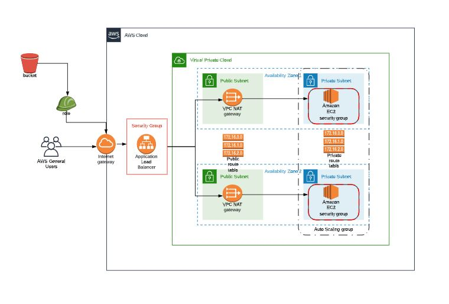

# Infrastructure-as-code-AWS
DevOps Nanodegree

This project will showcase understanding of all the AWS resources setup using AWS Cloud Formation. The project's application is stored of AWS S3 Bucket with and IAM role attached to the EC2 Instance to access the application. 

The project also contains infrastructure diagram using which the infrastructure is developed. 

Please find the FinalOutput.jpg in the folder to view the output from Load Balancer 

http://serve-webap-r2bzuqrwk1ww-1612809672.us-west-2.elb.amazonaws.com/
